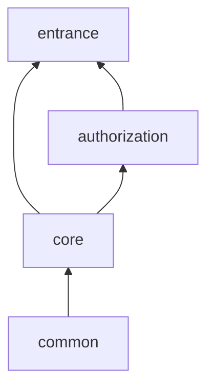

# 基础后端框架

## 框架环境
> 1. `JDK` 版本: `JDK 25` 
> 2. `Spring Boot` 版本: `3.5.6` 
> 3. 

## 项目架构
### 1）、项目模块说明
- `common` ： 通用模块，用于对系统内的通用功能, 如常量、枚举、工具类、异常类、日志类、配置类等内容
- `core` ： 核心模块，用于对系统内的基础架构
- `module` : 模块模块，用于对系统内的实体类模块
- `authorization` : 授权模块，用于对系统内的权限功能
- `entrance` : 入口模块，用于启动项目
### 2）、模块依赖关系

