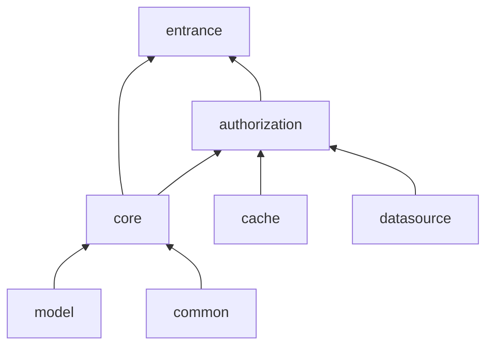

# 基础后端框架

> 注意,当前项目参考 `RuoYi`、`RuoYi-Vue-Plus` 框架, 若有疑问可参考相关项目进行排查

## 框架环境
> 1. `JDK` 版本: `JDK 21`
>    1. `Java` 开发工具包
> 2. `Spring Boot` 版本: `3.5.6`
>    1. 项目框架 
> 3. `ORM` 框架版本: `Spring JPA 3.5.6`
>    1. ORM 框架 
> 4. `Maven` 版本: `Maven 3.9.11`
>    1. 依赖管理工具 
> 5. `Sa-Token` 版本: `Spring Boot 3 的 1.44.0`
>    1. 权限认证框架

## 项目架构
### 1）、项目模块说明
- `authorization` : 授权模块，用于对系统内的登录、注销、权限认证等权限操作功能
- `cache`: 缓存模块，用于对系统内的缓存功能(该缓存模块可实现本地缓存 caffeine 和 远程缓存 redis 两种缓存方式)
- `common` ： 通用模块，用于对系统内的通用功能, 如常量、枚举、工具类、异常类、日志类、配置类等内容
- `core` ： 核心模块，用于对系统内的基础架构
- `datasource`: 数据源模块，用于对系统内的数据源配置功能,其他需要用到数据库连接功能模块均可通过引入该模块方式进行调用数据库方法
- `entrance` : 入口模块，用于启动项目
- `model` : 模型模块，用于对系统内的实体类模块
  - 该模块按业务进行分包,当前存在的包如下:
    - business: 业务模型模块, 主要用于对业务所需的模型实体类进行存放,当前存在如下包:
      - login: 登录模型模块
      - userInfo: 用户信息模型模块
    - exception: 异常模型模块
      - base: 基础异常模块
      - file: 文件异常模块
      - service: 业务异常模块
      - user: 用户异常模块
    - response: 响应模型模块
### 2）、模块依赖关系

